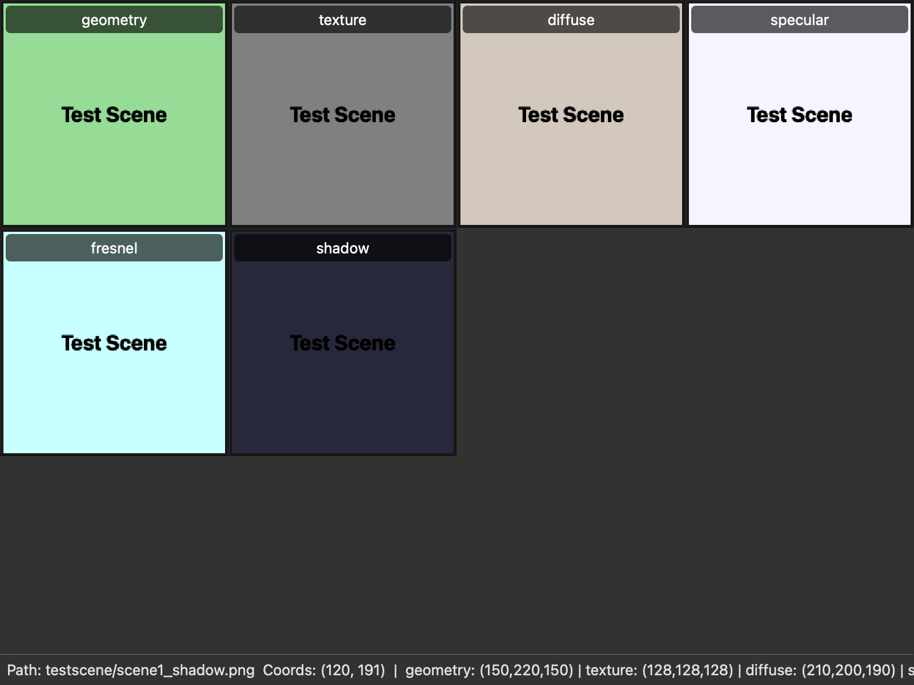

# Image Grid Viewer

[](https://www.python.org/downloads/)
[](https://opensource.org/licenses/MIT)

A lightweight, Python-based desktop tool for displaying a grid of images. It is designed to help researchers and developers quickly visualize and compare multiple images—such as different modalities of a scene or outputs of an algorithm—in a single, synchronized window.


*(A screenshot of the application in action.)*

---

## Key Features

-   **Synchronized Grid:** Display multiple images in a scrollable grid. Zooming and panning are synchronized across all images for precise, pixel-level comparison.
-   **Synchronized Pixel Inspector:** Move your cursor over any image to see the pixel coordinates and RGB values for that location across *all* images in the grid, displayed live in the status bar.
-   **Persistent Labels:** Each image view is overlaid with a clear, non-zooming label derived from its filename, so you always know which modality you're looking at.
-   **Customizable Layout:** Easily adjust the number of grid columns via the `--columns` argument.
-   **Robust Error Handling:** Gracefully handles common issues like missing files, permission errors, and unsupported formats by displaying an informative message in the respective grid cell without crashing.
-   **Simple CLI:** Launch the viewer directly from your terminal with a straightforward command-line interface.

---

## Requirements

This project's dependencies are managed in `pyproject.toml`. The installation commands below will handle them automatically.
-   **Runtime:** Python 3.8+ and `PySide6`.
-   **Development:** `pytest` and `pytest-qt` for running the test suite.

---

## Installation

1. Clone the repository:
   ```bash
   git clone https://github.com/Dav0ud/imagegridviewer.git
   cd imagegridviewer
   ```

2. Create and activate a virtual environment (recommended):
    ```bash
    # For Unix/macOS
    python3 -m venv venv
    source venv/bin/activate

    # For Windows
    python -m venv venv
    venv\Scripts\activate
    ```

3. Upgrade `pip` to the latest version within the virtual environment. This helps prevent potential installation issues.
   ```bash
   python -m pip install --upgrade pip
   ```

4. Install the project. For development, install it in "editable" mode (`-e`), which allows your code changes to be reflected immediately without reinstalling. The `[dev]` part includes testing dependencies like `pytest`.
```bash
# Install for development
pip install -e ".[dev]"
```
    
For regular use, you can install it normally:

```bash
pip install .
```

---

## Usage

After installation, you can run the application using the `igridvu` command from anywhere.

### Starting with a Dataset

To load a set of images directly, provide the common image prefix:

```bash
igridvu <image_prefix> [suffix_file] [--columns N]
```

### Arguments:
*   `image_prefix`: The common prefix for the image files. This can be just a name prefix (e.g., `image_`) or include a path (e.g., `path/to/my_data/run_1_`).
*   `suffix_file`: (Optional) A text file containing image suffixes, one per line. Defaults to `igridvu_suffix.txt` located in the same directory as the `image_prefix`. If `image_prefix` has no path, it looks in the current directory.
*   `--columns N`, `-c N`: (Optional) Sets the number of columns in the grid. Defaults to 4.

### Example:
Imagine you have images representing different illumination components of a scene, all located in a `testscene` directory: `testscene/scene1_diffuse.png`, `testscene/scene1_specular.png`, etc.

1.  Create a suffix file named `igridvu_suffix.txt` in the `testscene` directory that lists the unique parts of the filenames:
    ```text
    diffuse.png
    specular.png
    shadow.png
    ...
    ```
2.  Run the viewer from your terminal, providing the path and common prefix. The tool will automatically find the suffix file.
    ```bash
    # The prefix includes the directory path
    igridvu testscene/scene1_
    ```
    To display the images in a 3-column grid instead of the default 4:
    ```bash
    igridvu testscene/scene1_ --columns 3
    ```

### Starting Without Arguments (GUI First)

If you run `igridvu` without any arguments, the application will start with a welcome screen. From here, you can:
-   **Create Example Dataset...**: This option (also available in the "Help" menu) will prompt you to choose a directory where it will create a `testscene` folder containing sample images. This is the recommended way to see the application's features in action.
-   **Open Suffix Editor...**: This allows you to create or edit a suffix file.
-   **Open Dataset...**: Use the "File" menu to open an image from an existing dataset.


### Interaction

-   **Zoom:** Use the mouse wheel to zoom in and out. The view zooms towards your cursor.
-   **Pan:** Left-click and drag to pan the images.
-   **Inspect Pixels:** Move the mouse over an image. The status bar will display:
    -   The full path of the image under the cursor.
    -   The scene coordinates `(x, y)`.
    -   The RGB values at that coordinate for **every image** in the grid, identified by its label.

---

## Building a Standalone Application (macOS)

You can package the Image Grid Viewer as a standalone macOS application (`.app` bundle) using PyInstaller. This allows you to distribute and run the application without needing a separate Python installation.

**Prerequisites:**
- You must be inside your activated virtual environment.
- You must have the development dependencies installed, as described in the **Installation** section (`pip install -e ".[dev]"`).

**Build Process:**

1.  The first time you build, or if you need to regenerate the build configuration, run the following command. This creates an `igridvu.spec` file which controls the build settings.
    ```bash
    pyinstaller run_app.py --name igridvu --windowed --noconfirm
    ```

2.  **(Recommended)** For all subsequent builds, use the `igridvu.spec` file directly. This file has been optimized to exclude unused parts of the PySide6 library, significantly reducing the final application size.
    ```bash
    pyinstaller igridvu.spec --noconfirm
    ```

3.  Once the build process is complete, you will find the application bundle inside the `dist/` directory: `dist/igridvu.app`. You can drag this to your Applications folder and run it like any other macOS app.

---

## Testing

This project uses `pytest`. To run the test suite, ensure you have installed the project in editable mode with the `[dev]` extra, then run `pytest` from the project root:

```bash
# This command will discover and run all tests
pytest
```

---

## File Structure
- `pyproject.toml`: The heart of the project, defining metadata, dependencies, and entry points.
- `src/igridvu/`: The main application source code package.
- `pytest.ini`: Configures the `pytest` test runner, ensuring it can find the source code in `src/`.
  - `cli.py`: The command-line entry point.
  - `main_window.py`: Defines the main `QMainWindow`, orchestrates the grid layout, and handles view synchronization and status bar updates.
  - `zoomable_view.py`: Defines the custom `QGraphicsView` widget responsible for loading, displaying, and interacting with a single image (zoom, pan, pixel inspection).
- `scripts/`: Helper scripts for development.
- `tests/`: Unit and integration tests.
- `LICENSE`: The MIT License file for the project.
- `README.md`: This documentation file.

The viewer uses PySide6's `QPixmap` to load images, which supports most common image formats (PNG, JPEG, BMP, GIF, etc.).

---

## Future Vision

This tool is designed for **comparative analysis**. Future development could include powerful features for these workflows:

*   **Image Difference Mode:** Select two images to overlay them with transparency or view a computed "visual diff" that highlights changes.
*   **Metadata Integration:** Display key information from filenames (e.g., timestep, parameters) or EXIF data directly in the UI.

---

## Troubleshooting
The application will attempt to display an error message directly within the grid cell if an image cannot be loaded. Common messages include:

-   `Not found`: The file path constructed from the prefix and suffix does not exist.
-   `Permission denied`: The application does not have the necessary rights to read the image file.
-   `File too large` / `Dimensions too large`: The image exceeds internal safety limits to prevent excessive memory usage.
-   `Unrecognized format` / `Cannot load`: The file is not a valid or supported image format, or it may be corrupted.

If images are not displaying correctly, first check the status bar by hovering over the cell to confirm the expected file path is correct.

---

## Author
Davoud Shahlaei

This project was created to help evaluate algorithm outputs and as a learning exercise in Python and PyQt (now switched to PySide6). Feedback and contributions are welcome!
